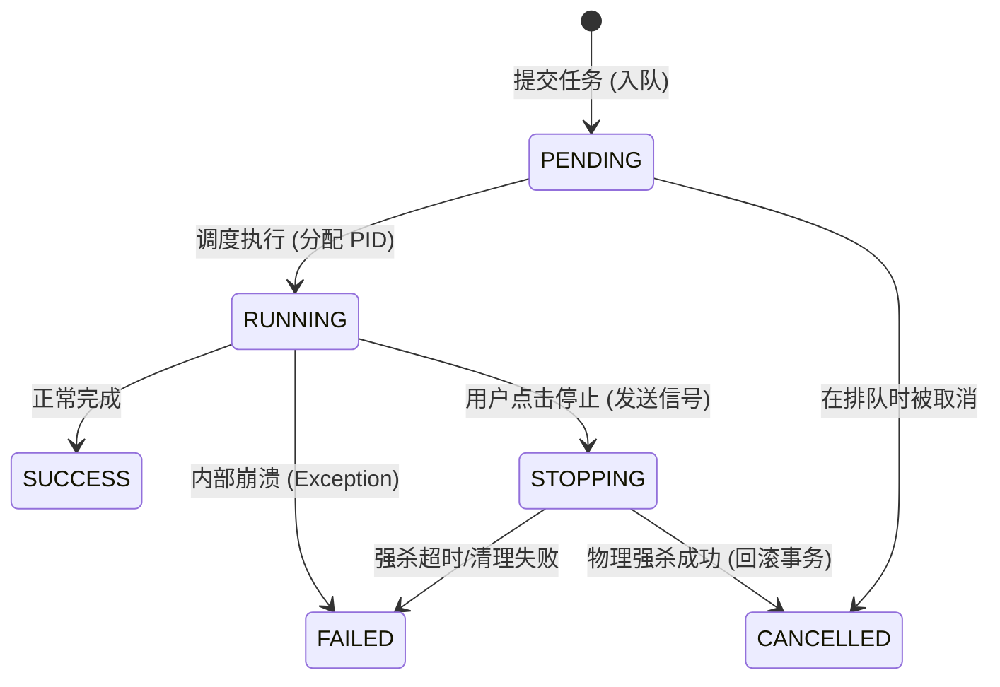

# AIStock Pro 任务管理引擎 V5.0 技术规格书 (Merged Spec)

## 1. 项目愿景 (Project Vision)
将 AIStock Pro 的任务管理模块从业务代码的“寄生者”进化为系统架构的“指挥家”。
通过实现**定义、执行、调度、审计**的四位一体设计，为量化投研提供工业级的可靠性和透明度。核心目标是消除所有“幽灵任务”，确保系统资源受控，并为未来的自动化交易与大规模数据分析奠定稳固的工程底座。

## 2. 数据模型设计 (Data Schema)
### 2.1 任务注册表 (Task Definitions)
该表存储系统中所有可执行的任务单元元数据。
*   **code** (String, PK): 任务唯一编码（如 `sync_market`）。
*   **name** (String): 任务名称。
*   **description** (Text): 描述。
*   **cron_expr** (String): CRON 表达式（如 `0 18 * * 1-5`）。
*   **is_enabled** (Boolean): 是否启用调度。
*   **module_path** (String): 任务函数路径。

### 2.2 任务执行流水 (Task Executions)
记录每次任务的动态运行状态，支持完整回溯。
*   **id** (UUID, PK): 执行唯一 ID。
*   **task_code** (String, FK): 关联定义表。
*   **params** (JSON): 启动时传入的完整参数快照。
*   **status** (Enum): PENDING, RUNNING, STOPPING, SUCCESS, FAILED, CANCELLED。
*   **progress** (Integer): 0-100。
*   **pid** (Integer): 操作系统进程/协程 ID。
*   **result_msg** (Text): 简要执行结论或错误堆栈。
*   **start_time** (DateTime): 启动时间。
*   **end_time** (DateTime): 结束时间。

## 3. 核心引擎架构 (Core Engine)

### 3.1 任务注册中心 (Registry)
采用 **装饰器模式** 实现业务零耦合接入。
*   **用法**：`@task_engine.register(code="sync_data", name="行情同步")`。
*   **原理**：在应用启动时，装饰器自动扫描业务模块，并将任务元数据同步至 `TaskDefinition` 表（若已存在则更新描述）。

### 3.2 并发执行器 (Executor & Semaphore)
*   **流量管控**：内置 `asyncio.Semaphore(10)`，确保系统瞬时活跃协程不超过 10 个。
*   **状态追踪**：执行器负责在任务启动前创建 `TaskExecution` 记录，并在 `finally` 块中清理内存句柄。
*   **原子性**：包装 `async with db.begin():`，确保任务逻辑与状态更新在同一个事务上下文中。

### 3.3 定时调度器 (Scheduler)
*   **内核**：集成 `APScheduler` 的 `AsyncIOScheduler`。
*   **持久化**：使用 `SQLAlchemyJobStore`，将调度计划存入数据库，确保重启不丢失。
*   **动态性**：提供 API 支持运行时修改 `cron_expr` 或暂停/恢复 Job。

## 4. 任务生命周期 (Task Lifecycle)
系统采用严格的状态机控制，确保任务在任何时刻的资源状态是确定的：

**关键机制说明：**
*   **STOPPING 态**：标志着系统已发出 `task.cancel()` 信号，但底层的事务和资源清理尚未完成。
*   **PENDING 态**：当系统并发达到 Semaphore 上限时，任务将在此等待。

## 5. API 接口规范 (API Specification)

| 路径 | 方法 | 说明 | 参数 |
| :--- | :--- | :--- | :--- |
| `/api/tasks/definitions` | GET | 获取所有已注册的任务定义 | 无 |
| `/api/tasks/definitions/{code}` | PUT | 修改任务计划（如 CRON） | `{cron_expr: str, is_enabled: bool}` |
| `/api/tasks/executions/active` | GET | 获取当前运行/排队中的任务 | 无 |
| `/api/tasks/executions/history` | GET | 分页获取执行历史 | `page, limit, task_code` |
| `/api/tasks/executions` | POST | 手动触发一个任务 | `{task_code: str, params: dict}` |
| `/api/tasks/executions/{id}` | DELETE | 停止运行中的任务 | 无 |
| `/api/tasks/executions/history` | DELETE | 清理历史记录 | `{days_ago: int}` |

## 6. 前端 UI 设计 (Frontend Design)

### 6.1 活跃任务浮窗 (Status Button & Popup)
*   **触发**：点击右下角悬浮按钮。
*   **内容**：任务名、状态（RUNNING/PENDING）、启动时间、进度条、停止按钮。
*   **交互**：点击任务条目，可快速跳转至详情审计页查看实时日志（若有）。

### 6.2 任务定义看板 (Registry Management)
*   **列表展示**：系统所有已注册业务任务。
*   **管理**：支持切换“启用/禁用”调度。
*   **调度编辑**：支持输入并校验 CRON 表达式（如 `0 9 * * 1-5`）。
*   **手动干预**：提供【立即执行】按钮，弹窗输入 JSON 参数。

### 6.3 执行历史审计 (History Audit)
*   **审计列表**：展示所有历史执行记录。
*   **详情查阅**：点击记录可弹窗查看该次任务的**完整参数 (Params)** 和 **结果/错误信息 (Result)**。
*   **清理工具箱**：
    *   **快速清理**：下拉选择“清理 7/30 天前记录”。
    *   **精准打击**：支持多选记录，点击【批量删除】。

## 7. 异常处理与自愈 (Self-Healing)

### 7.1 启动一致性巡检
系统启动时（`startup_event`），Housekeeper 将执行以下逻辑：
1.  查询所有状态为 `RUNNING` 或 `STOPPING` 的记录。
2.  将其状态统一更新为 `FAILED`。
3.  在 `result_msg` 中注明：`[系统自愈] 服务器意外重启，任务强制中断`。

### 7.2 强杀超时处理
若任务在 `STOPPING` 状态下超过 30 秒仍未完成清理逻辑，执行器将强制剥离句柄，并将状态置为 `FAILED`，释放信号量槽位。
