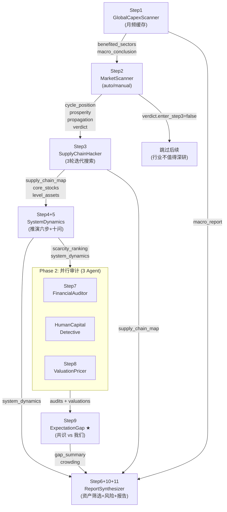

# 二、智能体设计

> 本文档详细定义 8 个 Agent 的 I/O 契约、内部逻辑、推演方法论和协作数据流。

---

## 2.1 Agent 继承体系

```
BaseAgent (framework/agents/base.py)
  抽象基类: analyze(), stream(), load_context()
    │
    └── ResearchAgent (domain/research/agents/base.py)
          注入 data_loader, 标准化 load_context → build_prompt → LLM → parse_result
            │
            ├── GlobalCapexScanner      Step 1: 宏观与全球资本周期
            ├── MarketScanner           Step 2: 行业景气度看门人
            ├── SupplyChainHacker       Step 3: 产业链系统拆解
            ├── SystemDynamicsAgent     Step 4+5: 系统动力学 + 非线性推演 ★ 独立新建
            ├── FinancialAuditor        Step 7: 财务质量审计
            ├── HumanCapitalDetective   人力资本审计
            ├── ValuationPricer         Step 8: 估值体系
            ├── ExpectationGapAgent     Step 9: 市场预期差 ★ 新建
            └── DAGOrchestrator         Step 6+10+11: 编排 + 资产筛选 + 风险 + 报告
```

---

## 2.2 Agent 协作数据流



---

## 2.3 各 Agent 详细设计

### Agent 1: GlobalCapexScanner (宏观与全球资本周期)

**文件**: `domain/research/agents/global_capex_scanner.py`

| 属性 | 值 |
|------|------|
| 触发频率 | 月频 (30 天缓存, `valid_until` 过期自动重跑) |
| 数据源 | DB 结构化 (7 变量) + 半结构化 (3 变量) + Web Search (3 变量) |
| LLM 调用 | 1 次 (综合分析) |
| 输出缓存 | `data/macro_report.json` (单文件覆盖) |

#### 数据获取策略

```
类别 A: 结构化管线 (akshare → DB) — 7 变量, 无需搜索
══════════════════════════════════════════════════════
变量              数据源                                  状态
────────────────────────────────────────────────────────
fed_rate          ak.macro_bank_usa_interest_rate()      ⚠️ 数据过时
us10y + 2s10s     ak.bond_zh_us_rate()                   ✅
inflation         ak.macro_usa_cpi_monthly/yoy           ❌ 待修复
china_pmi         ak.macro_china_pmi()                    ✅
usa_pmi           ak.macro_usa_ism_pmi()                  ❌ 待修复
china_monetary    ak.macro_china_lpr() + money_supply()   ✅
china_property    ak 房地产数据                            ❌ 新增

类别 B: 半结构化 (DB + 搜索补充) — 3 变量
══════════════════════════════════════════════════════
dxy               新浪 hf_DINIW 待修复 / 搜索兜底
china_fiscal      赤字率可结构化, 专项债政策需搜索
china_mfg         工业增加值可结构化, 产能利用率需搜索

类别 C: 纯搜索+LLM (定性判断) — 3 变量
══════════════════════════════════════════════════════
liquidity         全球流动性方向 (QT进度/央行扩表/信贷脉冲)
geopolitics       芯片管制/关税/台海 — 实时事件
industrial_policy 半导体/AI/新能源产业政策
```

#### Pipeline 集成

```python
# supply_chain_pipeline Phase 0
macro = GlobalCapexScanner.load_macro_cache()
if macro is None or _is_expired(macro):
    scanner = GlobalCapexScanner(provider=provider)
    macro = await scanner.synthesize_macro_report()
# macro["data"] 传入后续 Agent context
```

#### 输出 Schema

```json
{
  "macro_conclusion": {
    "cycle_stage": "复苏后期 — 全球制造业PMI回升, 中国信用扩张温和",
    "liquidity_direction": "美联储缩表尾声→H2可能停止, 中国央行偏松",
    "risk_appetite": "中等偏高 — AI投资热情持续但地缘风险压制",
    "global_capex_direction": "AI基础设施+能源转型双主线, 半导体capex YoY+25%",
    "china_focus": "新质生产力主导 — 半导体/大飞机/低空经济",
    "benefited_sectors": [
      {"sector": "AI算力基础设施", "driver": "MAG7 capex $700B+", "confidence": "高"},
      {"sector": "半导体设备/材料", "driver": "国产替代+全球扩产", "confidence": "高"},
      {"sector": "电力设备/电网",  "driver": "AI数据中心电力需求", "confidence": "中高"},
      {"sector": "工业金属(铜/铝)", "driver": "供给刚性+电气化需求", "confidence": "中"}
    ],
    "key_risks": ["美国大选年政策不确定性", "台海/芯片摩擦升级", "全球通胀二次反弹"]
  },
  "data_sources": {
    "fed_rate": {"value": "5.25-5.50%", "as_of": "2026-05-01", "source": "FOMC"},
    "us10y":    {"value": "4.2%",       "as_of": "2026-05-23", "source": "web search"},
    "china_pmi":{"value": "50.4",       "as_of": "2026-04-30", "source": "NBS official"}
  },
  "generated_at": "2026-05-24T10:00:00",
  "valid_until": "2026-06-24T10:00:00"
}
```

**当前状态**: 结构化数据 75% (12/16), 报告合成已交付, Pipeline Phase 0 已集成。

---

### Agent 2: MarketScanner (行业景气度看门人)

**文件**: `domain/research/agents/market_scanner.py`

| 属性 | 值 |
|------|------|
| 模式 | auto (验证 Step1 假设, 批量) / manual (用户指定, 单行业) |
| 搜索深度 | auto: 每行业 2 轮 / manual: 4 轮 |
| 核心理念 | **定性判断** — LLM 做归类, 不做数值评分 |
| DAG 角色 | **看门人** — 判断行业是否值得进入昂贵的 Step 3 |

#### 双模式行为差异

| 维度 | auto (扫描) | manual (深度) |
|------|-----------|-------------|
| 输入 | Step1 benefited_sectors | 用户指定行业 |
| 搜索深度 | 每行业 2 轮 | 4 轮 |
| 输出 | 多条排序列表 (每条含 6 块) | 单条完整 6 块 |
| 耗时 | ~30s (4 行业) | ~45s (1 行业) |

#### 输出 Schema (6 个定性块)

```json
{
  "industry": "AI 电力基础设施",

  "cycle_position": {
    "phase": "bottleneck_formation",
    "sub_phase": "early",
    "evidence": "变压器交期>12个月, 电网扩容订单+200%, 铜价创新高",
    "next_phase": "capital_frenzy",
    "estimated_duration": "12-18个月",
    "phase_switch_trigger": "当电网CAPEX增速>需求增速时"
  },

  "prosperity": {
    "type": "supply_shock",
    "demand_quality": "real_demand",
    "demand_evidence": "终端电力消费+15%, 数据中心在建项目+40%, 非渠道囤货",
    "growth_narrative": "AI电力需求爆发 vs 电网建设周期3-5年",
    "core_contradiction": "需求增速35% vs 供给响应周期3-5年",
    "driver_decomposition": [
      {"driver": "AI数据中心", "weight": "主导(55%)", "certainty": "高", "duration": "3-5年"},
      {"driver": "电网升级",   "weight": "重要(25%)", "certainty": "中高", "duration": "5-10年"},
      {"driver": "新能源并网", "weight": "辅助(20%)", "certainty": "中", "duration": "3-5年"}
    ]
  },

  "payoff": {
    "asymmetry": "强非对称",
    "narrative": "若AI电力需求兑现→利润池扩大5倍; 若证伪→电网升级需求只是推迟"
  },

  "propagation": {
    "depth": "深",
    "chain": "变压器 → 开关柜 → 铜 → 电缆 → 电力电子 → 液冷 → 柴油发电机",
    "alpha_implication": "长传导链=每解决一个瓶颈就创造新瓶颈, 多轮轮动机会"
  },

  "verdict": {
    "enter_step3": true,
    "priority": "高",
    "rationale": "供给刚性极强, 传导链深(7层), 市场认知仍停留在概念阶段",
    "key_uncertainties": ["AI算力需求增速是否放缓", "电网投资是否因财政压力推迟"]
  },

  "kill_reasons": []
}
```

#### 6 块输出的下游消费

| 块 | 下游消费 |
|---|---------|
| `cycle_position` | Step3 从哪个环节切入; Step8 影响估值方法选择 |
| `prosperity` | Step3 搜索关键词方向; Step4 推演路径; Step9 预期差对照 |
| `payoff` | Step6 与审计分数一起调整 top_picks 权重 |
| `propagation` | Step3 depth 决定供应链展开层数; Step4 推演起点 |
| `verdict` | Pipeline: enter_step3=false 则跳过; priority 排序送 top N |
| `kill_reasons` | 报告审计: 为什么排除了某个行业 |

**当前状态**: ✅ 设计+实现已完成, 双模式通过测试。

---

### Agent 3: SupplyChainHacker (产业链系统拆解)

**文件**: `domain/research/agents/supply_chain_hacker.py`

| 属性 | 值 |
|------|------|
| 搜索轮数 | 3 轮迭代 (搜索→LLM→自检缺口→补搜), 搜索策略由 Step 2 标签驱动 |
| 核心职责 | L1-L4 瓶颈定位 + 每环节定性评估 (LLM 做归类, 不做数值评分) |
| 分析哲学 | 回答: 谁拥有定价权? 谁控制供给? 核心利润池在哪? |
| 输入 | Step 2 的 cycle_position / prosperity_type / propagation_depth → 驱动搜索框架 |

> **设计原则**: 所有字段使用定性枚举标签, LLM 从搜索文本推理归类而非猜测数字。枚举值由 glossary.py 统一定义, prompt 末尾注入。

#### 每环节输出 Schema (V6.0 定性版)

```json
{
  "level": 1,
  "name": "先进封装 CoWoS",
  "bottleneck_narrative": "台积电独家供应, 扩产需18个月, 无替代方案可量产",

  "supply_rigidity": {
    "severity": "extreme",
    "root_cause": "equipment_constraint",
    "expand_cycle": "18_24_months",
    "substitutability": "none_short_term",
    "concentration": "monopoly_single_supplier",
    "alpha_narrative": "独家供给刚性=定价权极高, 景气窗口精确可算"
  },

  "profit_pool": {
    "share_of_industry_profit": "dominant_30_50pct",
    "margin_level": "very_high_above_40pct",
    "pricing_power_narrative": "卖方市场, 价格持续上涨中, 下游无议价能力"
  },

  "value_capture": {
    "market_attention": "very_high",
    "attention_quality": "profit_real",
    "gap_narrative": "市场高度关注但利润确实集中在这里 — 稀缺溢价合理, 非泡沫",
    "who_captures_value": ["台积电(封装)", "AMAT(设备)", "ABF基板(材料)"]
  },

  "competitive_landscape": {
    "structure": "oligopoly_CR3_above_70",
    "global_leaders": ["台积电", "三星"],
    "china_substitution_rate": "below_5pct",
    "china_players": {"tier1": [], "tier2": ["长电科技"], "tier3": ["通富微电"]}
  },

  "future_outlook": {
    "next_2_3_years": "bottleneck_persists",
    "potential_relief": "台积电2028新厂投产但远水不解近渴",
    "emerging_bottleneck": "ABF基板可能成为下一个瓶颈"
  },

  "assets": [
    {"code": "688012", "name": "中微公司", "role": "刻蚀设备", "market_position": "tier2_challenger"}
  ]
}
```

**关键变化 (vs V1 草案)**:
- `scarcity_indicators` + `rigidity_structure` → 合并为 `supply_rigidity` (消除重叠)
- 所有数字评分 (pricing_power=9, demand_urgency=9, attention_level=9) → 定性枚举标签
- `value_capture` 核心输出从数值改为 `attention_quality` (profit_real/profit_diverted/under_the_radar/deservedly_low)
- 新增 Step 2 标签驱动搜索策略 (不同 cycle_position 搜不同关键词)
- 全部枚举值注入 glossary.py, LLM prompt 末尾强制注入, 杜绝自创值

**当前状态**: 设计已修正, 待 prompt 重写实现。

---

### Agent 4+5: SystemDynamicsAgent (系统动力学 + 非线性推演) ★ 独立新建

**文件**: `domain/research/agents/system_dynamics_agent.py` ★ 全新独立文件

> **决策 D1**: 从 `supply_chain_hacker.py` 的 `_second_level_analysis()` 方法拆分为独立 Agent。
> 理由: 可单独 curl 测试, 符合单一职责原则, 便于独立调试推演 Prompt。

| 属性 | 值 |
|------|------|
| 文件 | `domain/research/agents/system_dynamics_agent.py` ★ 新建 |
| 核心方法论 | 推演六步 + 推演十问 + 6 个案例模板 |
| 核心职责 | 回答"谁最缺/谁受益于供给收缩/隐藏受益者" |
| 输入 | Step 3 的 supply_chain_map + core_stocks |
| LLM 调用 | 1-2 次 (推演 + 排名) |
| 可独立测试 | `curl POST /api/research/system-dynamics` |

#### 推演六步 (嵌入 System Prompt)

```
需求变化 → 资源变化 → 供给变化 → 价格变化 → 利润变化 → CAPEX变化 → 再平衡

六步:
1. 确定主驱动力 — 真正的驱动变量是什么？
2. 寻找约束条件 — 什么东西最先不够？
3. 分析资源迁移 — 高利润会吸走谁的资源？
4. 分析系统再平衡 — 什么时候供给会恢复？
5. 寻找利润池迁移 — 利润最终会流向谁？
6. 寻找最后被市场发现的人 — Alpha 来源
```

#### 6 个案例模板 (few-shot, 嵌入 Prompt)

| # | 模式 | 推演链 |
|---|------|--------|
| 1 | 资源挤占 | HBM消耗3x晶圆 → 挤占DDR产能 → DRAM涨价 → 二线DRAM厂受益 |
| 2 | 联产经济学 | 炼油减产 → 硫磺供给收缩 → 磷肥飞涨 → 化肥企业受益 |
| 3 | 瓶颈迁移 | GPU短缺 → 云厂自研芯片 → CoWoS成新瓶颈 → 封装设备受益 |
| 4 | CAPEX错配 | 成熟制程CAPEX不足 → MCU缺货2年 → 成熟代工厂暴利 |
| 5 | 利润池迁移 | AI从硬件 → 软件 → 云服务 → 应用, 利润流向不同阶段 |
| 6 | 供给刚性 | 高纯石英砂只有北卡矿 → 光伏扩产 → 石英砂2年涨价10倍 |

#### 推演十问 (每轮 LLM 分析末尾强制回答)

```
1. 真正驱动力？
2. 哪个资源最稀缺？
3. 高利润会吸走谁的资源？
4. 谁会供给下降？
5. 谁会意外涨价？
6. 谁拥有定价权？
7. 哪个瓶颈最难扩产？
8. 利润会迁移到哪里？
9. 市场还没发现谁？
10. 什么信号会证伪我？
```

#### 输出 Schema

```json
{
  "system_dynamics": {
    "resource_migration": [
      {"from": "低端DDR", "to": "HBM产线", "victim": "二线DRAM厂涨价受益", "A_stock": "688XXX"}
    ],
    "supply_constraints": [
      {"node": "CoWoS封装", "rigidity": 9, "reason": "台积电独家, 扩产需18个月"}
    ],
    "bottleneck_chain": ["GPU→HBM→先进封装→电力→铜→变压器→液冷"],
    "profit_pool_migration": [
      {"from": "硬件制造", "to": "AI算力服务", "timeline": "2026-2028"}
    ],
    "hidden_beneficiaries": [
      {"sector": "成熟制程测试厂", "reason": "先进制程受限→成熟制程爆满→测试需求激增"}
    ],
    "next_bottleneck_prediction": {
      "current": "CoWoS",
      "next_12m": "HBM3E产能",
      "next_24m": "数据中心电力",
      "next_36m": "液冷散热"
    },
    "victims": [
      {"segment": "服务器OEM", "why": "HBM涨价侵蚀BOM", "margin_impact": "-8pct", "market_awareness": "低"}
    ],
    "equilibrium_forecast": {
      "current_state": "供给短缺",
      "profit_signal": "暴利吸引全球CAPEX涌入",
      "capex_response": "全球在建产能+180%",
      "expected_relief": "2027Q3",
      "overcapacity_risk": "2028H1 进入供给过剩",
      "phase_transition_triggers": ["台积电CoWoS产能250K wpm", "三星HBM3E良率>80%"]
    },
    "thesis_breakers": [
      {
        "thesis": "CoWoS紧缺至2028",
        "break_condition": "台积电CoWoS产能翻倍+交期缩短至2个月以下",
        "current_probability": "低(15%概率在2027年前发生)",
        "watch_indicator": "台积电月度营收+资本开支指引"
      }
    ]
  },
  "scarcity_ranking": [
    {
      "rank": 1,
      "segment": "CoWoS封装",
      "scarcity_score": 9.2,
      "supply_rigidity": 9,
      "pricing_power": 9,
      "why_scarce": "台积电独家, 扩产需18个月, 需求3年翻3倍",
      "beneficiary_A_stocks": ["688012中微公司", "002371北方华创"]
    }
  ]
}
```

**当前状态**: 完成度 10%。原 `_second_level_analysis()` 方法将迁移到独立文件, 彻底重写。

**迁移计划**: `supply_chain_hacker.py` 中的 `_second_level_analysis()` 方法删除, 改为调用独立的 `SystemDynamicsAgent.analyze()`。

---

### Agent 7: FinancialAuditor (财务质量审计)

**文件**: `domain/research/agents/financial_auditor.py`

| 属性 | 值 |
|------|------|
| 输入 | stock_code (从 DB 读取 8Q 财务数据) |
| 核心能力 | 8Q剪刀差 + 四连击 + Beneish M-Score + OCF + 存货/合同负债 |
| 输出 | verdict (PASS/CAUTION/FAIL) + score + flags + metrics |

#### V6.0 增强: 盈利释放判断

```python
# 新增程序化判断
if consecutive_yoy_hits >= 4 and scissor_is_expanding and ocf_health == "healthy":
    release_stage = "盈利释放期"
elif scissor_gap < -20 and not four_quarters_hit:
    release_stage = "盈利承压期"
else:
    release_stage = "过渡期"

# 输出新增:
"earnings_release": {
    "stage": "盈利释放期",
    "evidence": "连续4Q营收同比增长 + 利润增速>营收增速 + OCF健康",
    "investment_implication": "盈利加速释放, 估值有上修空间"
}
```

**当前状态**: 85% 完成, 需增加 ~20 行盈利释放判断。

---

### Agent 8: ValuationPricer (估值体系)

**文件**: `domain/research/agents/valuation_pricer.py`

| 属性 | 值 |
|------|------|
| 核心能力 | VALUATION_MODEL_MAP + 三情景估值 + 全球对标 |
| 输出 | target_valuation + moat_window + position_suggest |

#### V6.0 增强: 非对称赔率

```json
"payoff_asymmetry": {
  "type": "强非对称 / 对称 / 负非对称",
  "narrative": "若国产替代兑现→利润3x; 若证伪→政策支撑底线, 下行有限",
  "asymmetric_score": "高"
}
```

**当前状态**: ✅ 核心已完成, 仅需增加 ~10 行 payoff_asymmetry。

---

### Agent 9: ExpectationGapAgent (市场预期差) ★ 新建

**文件**: `domain/research/agents/expectation_gap.py` ★ 全新文件

| 属性 | 值 |
|------|------|
| 触发时机 | Phase 2 完成后, 报告合成前 |
| 搜索轮数 | 2 轮 (券商一致预期 + 市场情绪/资金面) |
| 核心职责 | 发现市场尚未充分定价的预期差 |

#### 分析维度

| 维度 | 市场共识来源 | 我们的判断来源 |
|------|------------|--------------|
| 估值预期差 | 券商目标价一致预期 | Step 8 ValuationPricer |
| 盈利预期差 | 券商盈利预测 | Step 7 FinancialAuditor + 产业推演 |
| 风险预期差 | 市场定价的风险 | Step 4+5 thesis_breakers |
| 护城河预期差 | 市场认知的壁垒 | Step 3 supply_chain_map |

#### 输入

```json
{
  "stock_code": "688041",
  "stock_name": "海光信息",
  "industry": "CPU",
  "our_valuation": {},    // Step 8 ValuationPricer 输出
  "our_audit": {},        // Step 7 FinancialAuditor 输出
  "system_dynamics": {},  // Step 4+5 输出
  "supply_chain": {}      // Step 3 输出
}
```

#### 输出 Schema

```json
{
  "market_consensus": {
    "earnings_growth": "20%",
    "target_price": "xxx",
    "coverage_count": 30,
    "rating_distribution": {"buy": 20, "hold": 8, "sell": 2},
    "key_bull_thesis": "国产CPU替代加速",
    "key_bear_thesis": "技术差距仍大, 市占率提升缓慢"
  },

  "our_view": {
    "earnings_growth": "35%",
    "target_mcap": "2850亿",
    "key_difference": "市场低估了国产替代加速的利润弹性",
    "unique_insights": [
      "Step4发现: CPU供给收缩导致定价权转移, 利润弹性被低估",
      "Step3发现: 国产化率仅5%, 每提升1pct=巨大增量"
    ]
  },

  "gap_summary": [
    {"dimension": "估值", "consensus": "目标市值2400亿", "ours": "2850亿", "gap": "+19%", "confidence": "中高"},
    {"dimension": "盈利", "consensus": "增速20%", "ours": "35%", "gap": "超预期", "confidence": "高"},
    {"dimension": "风险", "consensus": "技术差距", "ours": "政策支撑下行底线", "gap": "高估风险", "confidence": "中"},
    {"dimension": "护城河", "consensus": "weak moat", "ours": "客户认证+政策壁垒", "gap": "低估壁垒", "confidence": "中高"}
  ],

  "crowding_assessment": {
    "level": "拥挤",
    "evidence": ["券商覆盖30+家", "公募重仓TOP10", "北向持续增持"],
    "alpha_implication": "高拥挤→即使景气兑现, 股价上行空间被压缩",
    "trading_implication": "关注预期差兑现时点, 而非趋势本身"
  },

  "catalyst_timeline": [
    {"catalyst": "Q2财报超预期", "expected_date": "2026-08", "impact": "盈利预期差兑现"},
    {"catalyst": "新品流片成功", "expected_date": "2026-Q4", "impact": "技术壁垒重估"}
  ]
}
```

#### 内部实现伪代码

```python
class ExpectationGapAgent(ResearchAgent):
    
    async def analyze(self, context: dict) -> dict:
        stock = context["stock_code"]
        name = context["stock_name"]
        industry = context["industry"]
        
        # 搜索 1: 券商一致预期
        consensus_query = f"{name} {stock} 券商 目标价 盈利预测 一致预期 评级 2026"
        consensus_results = await self.data_loader.search_web(consensus_query, num=5)
        
        # 搜索 2: 市场情绪/资金面
        sentiment_query = f"{name} 机构持仓 公募重仓 北向资金 两融余额 ETF 市场情绪 2026"
        sentiment_results = await self.data_loader.search_web(sentiment_query, num=5)
        
        # 组装 Prompt
        prompt = self._build_prompt(
            context=context,
            consensus_data=consensus_results,
            sentiment_data=sentiment_results,
            our_valuation=context.get("our_valuation", {}),
            our_audit=context.get("our_audit", {}),
        )
        
        # LLM 分析
        result = await self.provider.chat(
            system="你是买方预期差分析师。对比市场共识与我们的独立分析,识别预期差...",
            user=prompt,
            max_tokens=2048
        )
        
        return self._parse_result(result)
```

---

### Agent 10+11: ReportSynthesizer (DAGOrchestrator 增强)

**文件**: `domain/research/agents/dag_orchestrator.py`

#### V6.0 增强内容

| 增强项 | 改动 | 行数 |
|--------|------|------|
| Step 6: 核心资产筛选质量加权 | ROE/股息/增速 bonus | ~15行 |
| Step 10: 风险分析 Prompt 增强 | 概率×影响×定价 | ~10行 |
| Step 11: 报告模板 +3 节 | 预期差/推演/验证 | ~30行 |
| DAG 编排 +1 Agent | ExpectationGapAgent 接入 | ~5行 |

#### 报告模板 V6.0 (8 节)

```markdown
## 一、核心结论 (CIO Summary)
  final_summary: 2-4 句话

## 二、核心标的 (Top Picks)
  排名表: 代码/名称/判断/置信度/仓位/角色

## 三、产业链图谱 (Supply Chain)
  L1-L4 每层: 稀缺度/定价权/利润池/国产化率
  
## 三.五、产业推演 (System Dynamics) ★ 新增
  资源迁移 / 瓶颈链 / 受损方 / 隐性受益者 / 相变预测 / 证伪信号

## 四、交叉审计
  财务审计 (剪刀差/Beneish/OCF/盈利释放) + 人力审计 (创始人/专利/股权)

## 五、估值体系
  三情景 (牛/中/熊) + 全球对标 + 赔率非对称

## 六、市场预期差 ★ 新增
  | 维度 | 市场共识 | 我们的判断 | 差异 |
  拥挤度评估 / Alpha 含义 / 催化剂时间线

## 七、风险分析 (增强)
  每条: 概率 × 影响 × 是否已定价

## 八、论点验证 ★ 新增
  每个核心论点 + 领先指标 + 证伪信号 + 时间窗
```
